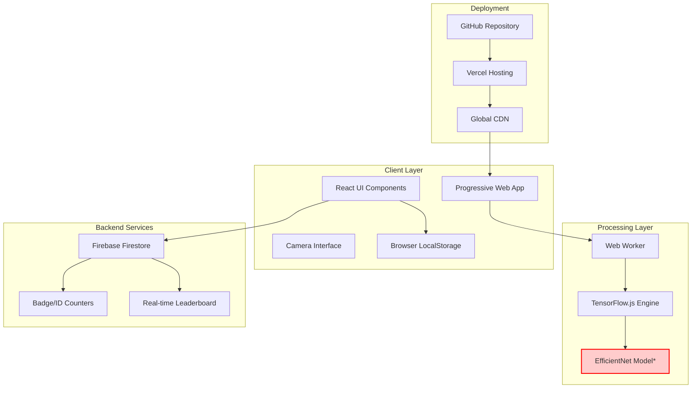
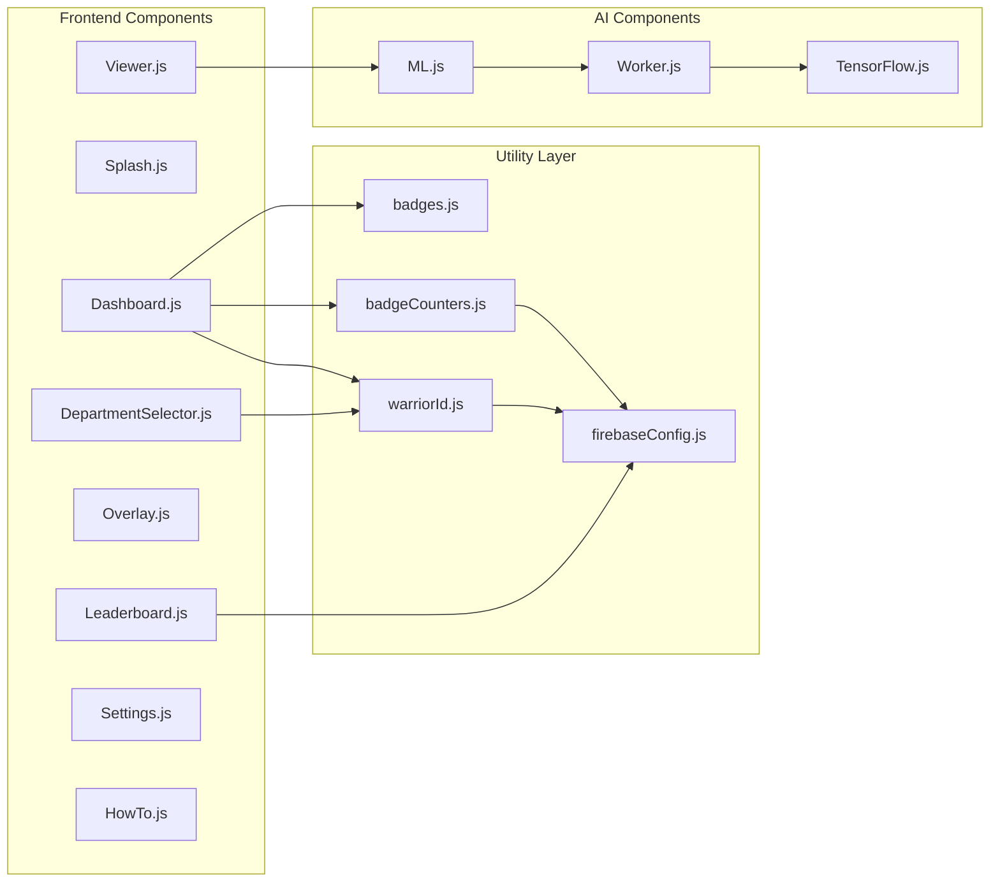
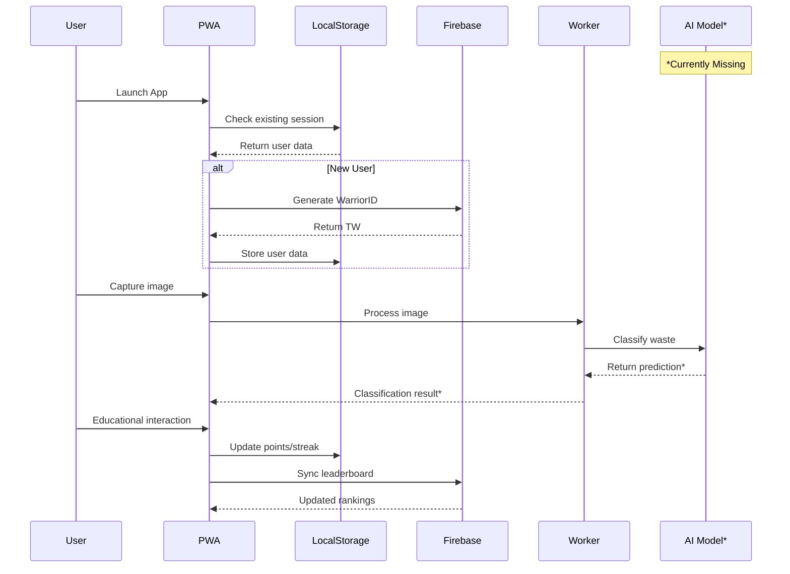
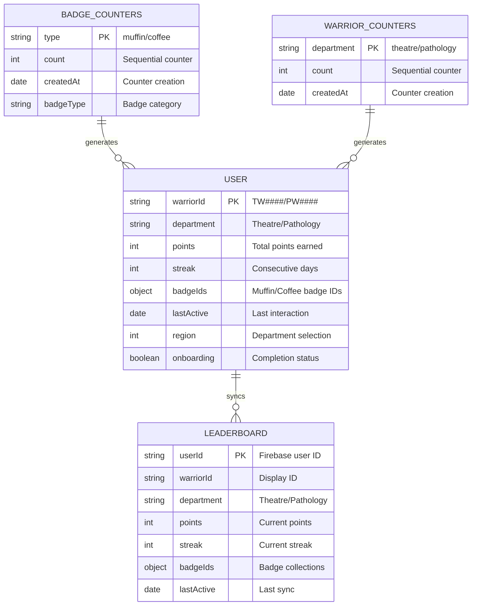
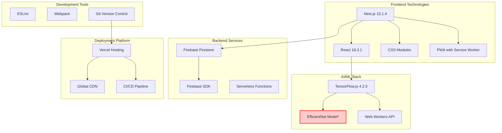
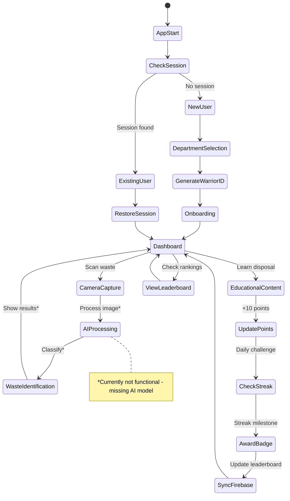
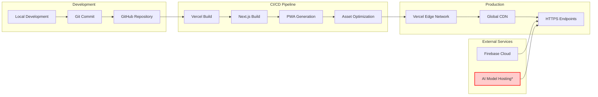

```mermaid
graph TB
    subgraph "PWA Features"
        Manifest[Web App Manifest]
        ServiceWorker[Service Worker]
        OfflineCache[Offline Caching]
        InstallPrompt[Installation Support]
    end
    
    subgraph "Offline Capabilities"
        LocalData[Local Data Storage]
        OfflineUI[Offline UI]
        BackgroundSync[Background Sync]
    end
    
    subgraph "Native-Like Features"
        FullScreen[Fullscreen Mode]
        HomeScreen[Home Screen Icon]
        PushNotifications[Push Notifications*]
    end
    
    Manifest --> ServiceWorker
    ServiceWorker --> OfflineCache
    OfflineCache --> InstallPrompt
    LocalData --> OfflineUI
    OfflineUI --> BackgroundSync
    FullScreen --> HomeScreen
    HomeScreen --> PushNotifications
    
    classDef future fill:#ccffcc,stroke:#00ff00,stroke-width:2px
    class PushNotifications future
```

# WasteWarrior Healthcare - System Architecture

## 🏗️ High-Level Architecture Overview

*Note: AI Model currently missing - requires training and deployment*

## 🎯 Component Architecture

## 📊 Data Flow Architecture

## 🗄️ Data Architecture

## 🔧 Technology Stack

## 🛂 Security & Privacy Architecture

```mermaid
graph TB
    subgraph "Privacy Layer"
        Anonymous[Anonymous Operation]
        LocalFirst[Local-First Data]
        NoPersonalData[No Personal Info]
    end
    
    subgraph "Data Protection"
        LocalStorage[Browser LocalStorage]
        Firebase[Firebase Security Rules]
        HTTPS[HTTPS Encryption]
    end
    
    subgraph "Access Control"
        DepartmentIsolation[Department Isolation]
        SecureCounters[Secure ID Generation]
        OfflineCapable[Offline Operation]
    end
    
    Anonymous --> LocalFirst
    LocalFirst --> NoPersonalData
    LocalStorage --> Firebase
    Firebase --> HTTPS
    DepartmentIsolation --> SecureCounters
    SecureCounters --> OfflineCapable
```

## 🔄 State Management Flow

## 📱 Progressive Web App Architecture

## 🚀 Deployment Architecture

## 📈 Scalability Architecture

```mermaid
graph TB
    subgraph "Horizontal Scaling"
        MultipleUsers[Multiple Users]
        LoadBalancing[Automatic Load Balancing]
        EdgeCaching[Global Edge Caching]
    end
    
    subgraph "Database Scaling"
        FirestoreAuto[Firestore Auto-scaling]
        GlobalDistribution[Global Distribution]
        RealTimeSync[Real-time Synchronization]
    end
    
    subgraph "Client Scaling"
        ClientSideAI[Client-side AI Processing]
        OfflineFirst[Offline-first Architecture]
        LocalCaching[Local Data Caching]
    end
    
    MultipleUsers --> LoadBalancing
    LoadBalancing --> EdgeCaching
    FirestoreAuto --> GlobalDistribution
    GlobalDistribution --> RealTimeSync
    ClientSideAI --> OfflineFirst
    OfflineFirst --> LocalCaching
```

## 🎯 Current Architecture Status

### ✅ **Implemented & Production-Ready**
- **Frontend Architecture**: Complete Next.js/React PWA
- **Data Layer**: Firebase Firestore with offline-first design
- **User Management**: WarriorID system with department isolation
- **Gamification**: Badge system with secure counters
- **Deployment**: Vercel CI/CD with global CDN
- **Security**: Anonymous operation with local-first privacy

### ❌ **Missing Components**
- **AI Model**: EfficientNet model not trained/deployed
- **Model Hosting**: No CDN endpoint for model.json
- **Environment Config**: Missing NEXT_PUBLIC_MODEL_URL
- **Training Pipeline**: No ML training infrastructure

### 🔄 **To Complete Architecture**
1. **Train medical waste classification model**
2. **Deploy model to CDN (e.g., AWS S3/CloudFront)**
3. **Configure environment variables**
4. **Test end-to-end AI pipeline**
5. **Validate healthcare compliance**

## 📋 Architecture Summary

**Current State**: **Sophisticated gamification platform** with complete user management, real-time leaderboards, and offline-first PWA capabilities.

**Missing**: **Core AI functionality** that provides the medical waste classification value proposition.

**Recommendation**: The architecture is **excellent and production-ready** for the gamification aspects, but requires **AI model development** to fulfill the healthcare waste management mission.

---

*This architecture supports hospital-wide deployment with the ability to scale to multiple healthcare facilities once the AI model is integrated.*